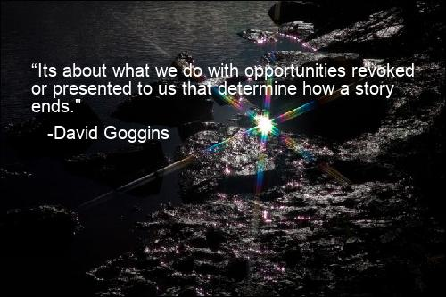

# Meme Generator

This project is a Meme Generator—a multimedia application that dynamically generates memes by overlaying quotes on images. The application can load quotes from various file types and manipulate and save images. It also accepts user input through a command line tool and a web service.

    

## Intent
The next level of advanced programming skills requires to **modularize** code and reuse these modules in **larger codebases**.

Therefore the learning equity of this application is the **Quote Engine**, that is an implemented **Complex Strategy**. This Engine is an Object that collects the same/similiar information from different filetypes and generates _quote objects_ that are collected and can be used for **random meme generations**. 

Those, as well as a created meme with chosen image and quote (as the title image of this Readme) can be created via script of **Flask application**

## Project Setup and Usage

### Flask App

To run the Flask app, follow these steps:

1. Install the required dependencies by running `pip install -r requirements.txt` in your terminal.
2. Run the Flask app by executing the command `python app.py`.
3. Open your web browser and navigate to `http://localhost:5000`.
4. On the web page, you can generate a random captioned image or upload your own image and write a custom quote.

### Meme Generator Script

To use the Meme Generator script, follow these steps:

1. Make sure you have the required dependencies installed by running `pip install -r requirements.txt` in your terminal.
2. Run the script by executing the command `python meme.py`.
3. By default, the script will generate a random captioned image and save it to the output directory specified in the script.
4. You can also provide optional arguments to customize the generated image. For example:
   - `python meme.py --body "This is the quote body" --author "John Doe"` will generate an image with the specified quote.
   - `python meme.py --path "/path/to/image.jpg" --body "This is the quote body" --author "John Doe"` will use the specified image and quote.

Please note that the Flask app and the Meme Generator script both rely on the same set of modules and packages, so make sure you have installed the dependencies before running either of them.

## Project Structure

The project is organized into multiple directories, each containing related classes and modules. Here's a brief overview of the main directories:

- `quote_engine`: Contains classes and modules related to loading and manipulating quotes from different file types.
- `meme_generator`: Contains classes and modules related to generating memes by overlaying quotes on images.
- `templates`: Contains HTML templates used by the Flask app.
- `static`: Contains static files used by the Flask app, such as CSS stylesheets and images.

For more details on the project structure and how the different modules interact with each other, please refer to the code and the comments within the files.

## License

This project is licensed under the MIT License. See the [LICENSE](LICENSE) file for more 